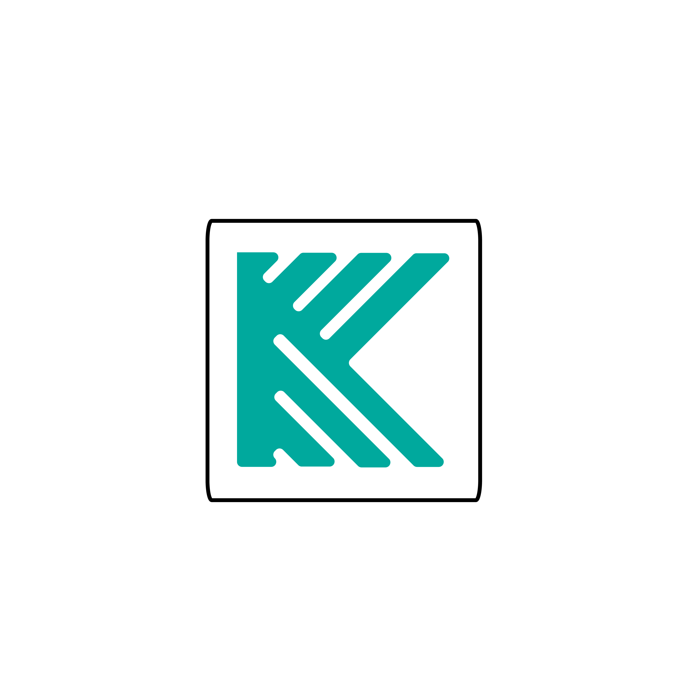

<p align="center">
  <a href="https://koders.in/">
    
  </a>
</p>
<p align="center">
  <i> "Your vision, Our Kreation" </i>
  <br> 
  <br> 
  An institution that caters to all your software needs with their touch of Koding.
  <br>
  <a href="https://www.koders.in"><strong>Explore More»</strong></a>
  <br>
  <br>
  <a href="https://www.github.com/koders-in">Github</a>
  ·
  <a href="https://www.linkedin.com/company/54359381/">LinkedIn</a>
  ·
  <a href="https://www.youtube.com/channel/UCZ5abFiwqKyJLIQ1Jqb6bNg">Youtube</a>
  ·
  <a href="https://www.instagram.com/koders_in/">Instagram</a>
</p>

# Introduction
Astro AIO selenium based footsite bot 

## Project Details
- ID - 0149
- Title - Astro AIO
- Assigned to - XHunter
- Hand-in date - 19/03/2021
- Hand-out date - 26/03/2021 (Expected)

## Description
Selenium based bot for Footlocker.ca, Footlocker.com, kidsfootlocker.com. (Read AstroAIO.txt for detailed requirements)

## How to run
- Install python from [here](https://www.python.org/downloads/)
```python
pip install -r requirements.txt
python app.py
```

## How to build
```python
pip install -U cx_freeze
python setup.py app.py
```

## Copyright and license
Code and documentation copyright 2017-2020 by the [koders](https://www.koders.in). Code released under the [MIT License](https://en.wikipedia.org/wiki/MIT_License).

<h3 align="center"> Made with ♡ by <a href="http://koders.in"> Koders </a></h3>


